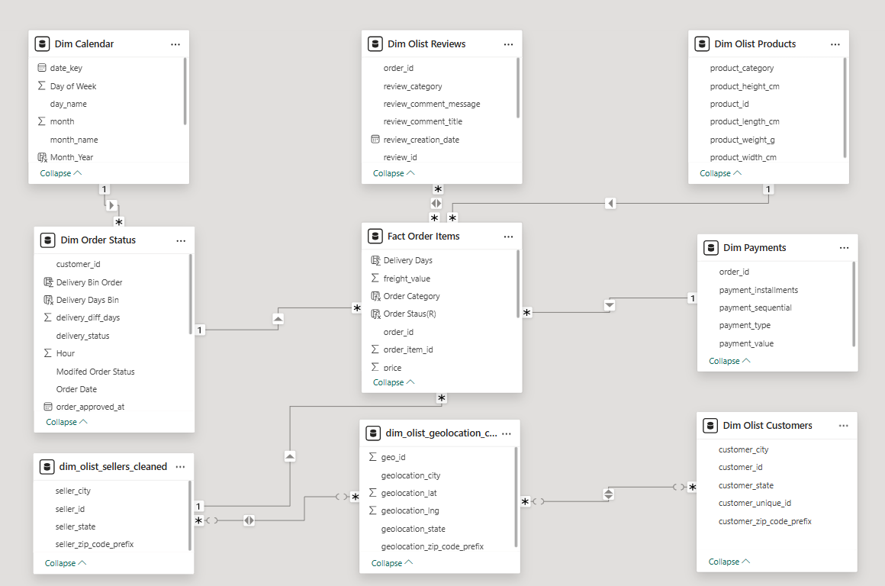

# Olist Brazilian E-commerce Analytics Project

End-To-End analytics project on real Olist Brazilian e-commerce data (2017–2018). This project blends technical expertise with clear business understanding to uncover what truly drives online retail performance and customer value.

Here, intricate and complex data is transformed into straightforward, actionable insights making the journey accessible and valuable for decision-makers, technical teams, and business leaders alike. From intelligent data cleaning and enrichment to user-friendly dashboards and practical recommendations, every element is designed to inform and inspire, fostering smarter conversations about growth, retention, and customer experience in the evolving world of e-commerce.

---

## 🚀 Project Goals

- Tackle huge, messy and complex e-commerce data
- Deliver insights that drive business action, not just reports

---

## 🗂️ Repository Structure

- **sql/** – Automated cleaning, schema, business SQL queries
- **python/** – Deep cleaning and enrichment: fuzzy matching,Brazalian to English translations of review titles, review categorisation by NLP
- **powerbi_dashboards/** – Dashboards, including business findings and strategy
- **reports/** – Insight_Report: the full story, including critical recommendations and strategies for business growth
- **docs/** – Data dictionary and summary notes
- **data/** – All raw data csv files

---

## 🗺️ Data Model Overview

The project uses a star schema for clear and efficient analytics.  

---

## 📊 Power BI Dashboards Overview

- **Executive Summary**  
  *One-page overview of total revenue, orders, ratings, and top-performing cities and products—key for quick insights by leaders.*

- **Sales Performance**  
  *Breaks down revenue, average order value, payment types, average installments and revenue trends over time, helping spot sales drivers, seasonal patterns and overall growth.*

- **Delivery Performance**  
  *Shows average delivery times, delay rates, delivery days distribution, delivery status and where deliveries are slow or face bottlenecks—enabling focused operational improvements.*

- **Review and Ratings Analysis**  
  *Visualizes customer ratings, identifies causes for poor reviews, and shows which categories or regions have the most positive reviews and satisfied customers while diving deep into lacking areas also.*

-  ***Geographic Trends***
  *Interactive map  showing total revenue, orders, and delivery times by state/city, and State-to-state route visualization showcasing order and revenue volumes and delivery delays on the most trafficked logistics paths.*

- **Insight Report & Strategic Recommendations**  
  *Highlights root business reports and problems, summarizes key analytical findings, and presents strategic actions to boost retention and sales.*

---

## 🔎 Executive Summary & Strategic Action (Highlights)

### Key Problems Identified
- Customer retention rate is only 3%
- Average delivery days (12.48) exceed market benchmarks
- Consistent negative correlation between delivery time and customer satisfaction
- Major delivery delays affect top revenue routes
- Spike of negative reviews in Feb & March 2018

> For complete insights and business strategic recommendations , see Olist Insight Reports & Strategic Recommendations Folder

---

## 💡 Project Highlights

- **SQL pipeline:** Automated profiling, robust cleaning of >1 million records, hybrid ETL
- **Python enrichment:** Fuzzy matching for typos, NLP review categorization, Azure review translation
- **Power BI dashboards:** Visual, executive-ready reporting—sales, customer, delivery, and review trends, each with clear business context and recommended actions

---

## 🛠️ Tech Used

- PostgreSQL, Python (pandas, fuzzywuzzy, Azure Translator, NLP), Power BI

---

## 📈 How to Use

- Run SQL and Python scripts in order shown
- Explore dashboards (png/pdf), or load .pbix for deeper analytics
- Read the insight report for high-level and strategic recommendations
